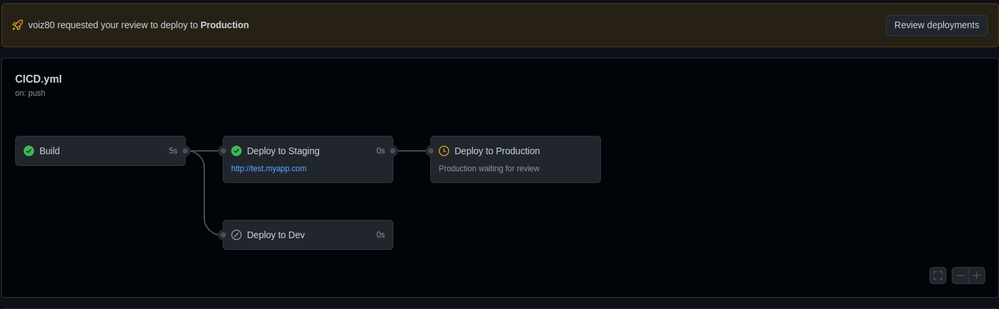

# actions
Show different GitHub Actions Features

CI/CD github workflow, env, building and deployment - staging, development, production 

## What will be hepend

pull request --> Development

merge  pull request --> Staging

review deployments --> Production

visual example:

